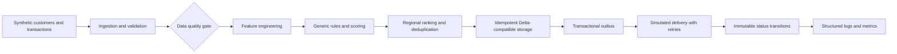

# Customer Engagement Data Platform

[](.github/workflows/test.yml)
[](pyproject.toml)
[](LICENSE)

An independent data engineering portfolio project that builds and delivers customer engagement recommendations from fully synthetic data. It demonstrates production-oriented patterns while remaining runnable on a laptop and independent of private infrastructure.

## Engineering highlights

| Capability | Executable evidence | Engineering value |
|---|---|---|
| Distributed feature engineering | [`spark_features.py`](src/engagement_platform/spark_features.py) and a real local Spark integration test | DataFrame aggregation, joins, date boundaries, null handling, and a portable Spark contract |
| Lakehouse write reliability | [`storage.py`](src/engagement_platform/storage.py), [`retry.py`](src/engagement_platform/retry.py), and [`partitioning.py`](src/engagement_platform/partitioning.py) | Idempotent Delta merge, explicit transient-error policy, and narrow target read scopes |
| Data quality | [`quality.py`](src/engagement_platform/quality.py) and generic [SQL expectations](sql/data_quality_checks.sql) | Required pre-delivery gates for uniqueness, ranges, references, time boundaries, and limits |
| Scoring and ranking | [`scoring.py`](src/engagement_platform/scoring.py) and [`ranking.py`](src/engagement_platform/ranking.py) | Transparent normalized scoring, deterministic ordering, top-K limits, and deduplication |
| Reliable application delivery | [`outbox.py`](src/engagement_platform/outbox.py), [`delivery.py`](src/engagement_platform/delivery.py), and [`reconciliation.py`](src/engagement_platform/reconciliation.py) | Transactional outbox, immutable state history, idempotency, timeout retry, and reconciliation |
| Safe historical processing | [`replay.py`](src/engagement_platform/replay.py) and [ADR 0002](docs/decisions/0002-replay-without-side-effects.md) | As-of reads, deterministic rebuilding, idempotent storage, and zero external side effects |
| Modular orchestration | [`dag.py`](src/engagement_platform/dag.py) and [`provenance.py`](src/engagement_platform/provenance.py) | Dependency modes, readiness gates, topological execution, explicit terminal states, and deterministic run lineage |
| Change-aware delivery | [`change_impact.py`](src/engagement_platform/change_impact.py), [`modules.toml`](configs/modules.toml), and [`benchmark.py`](src/engagement_platform/benchmark.py) | Module ownership, selective CI matrices, per-module versions, reproducible artifact tags, and measurable local runs |
| Platform engineering | [YAML configuration](configs/), [wheel packaging](pyproject.toml), and [Databricks bundle](databricks.yml) | Reproducible environments, recursive defaults, deployable artifacts, and public dependencies |
| Delivery quality | [GitHub Actions](.github/workflows/test.yml) and the [testing strategy](docs/testing-strategy.md) | Ruff, strict mypy, 52 tests including Spark, wheel build, 95%+ coverage, and content scanning |

### Five-minute technical tour

1. Start with the [architecture diagram](docs/architecture.md).
2. Inspect the orchestration path in [`EngagementPipeline`](src/engagement_platform/orchestration.py).
3. Review the [reliability trade-offs](docs/reliability.md), [modular platform design](docs/modular-platform.md), and [operations guide](docs/operations.md).
4. Run `pytest` to execute the pure-Python, integration, and Spark contracts.
5. Run the normal pipeline and historical rebuild commands shown below and compare their side effects.

## Architecture



The core implementation is pure Python for quick local execution. An optional PySpark transformation and Delta Lake merge adapter demonstrate how the same public contracts scale to distributed workloads. A generic Databricks Asset Bundle example is included without a workspace, identity, or private endpoint.

Read the detailed [architecture](docs/architecture.md), [data model](docs/data-model.md), [reliability design](docs/reliability.md), [operations guide](docs/operations.md), [testing strategy](docs/testing-strategy.md), and [clean-room design decision](docs/decisions/0001-clean-room-implementation.md).

## Engineering concepts

- deterministic synthetic data generation;
- configuration-driven pipeline behavior;
- feature engineering with pure Python and PySpark;
- transparent scoring, deterministic ranking, and deduplication;
- stable idempotency keys and Delta Lake merge semantics;
- literal partition scoping and bounded retry for concurrent mutations;
- transactional outbox and immutable state-transition history;
- historical as-of rebuilding with external delivery disabled;
- recursive workflow defaults with explicit overrides;
- DAG orchestration with dependency modes and readiness gates;
- deterministic provenance and order-independent batch fingerprints;
- TOML module registry, selective CI planning, and artifact version tags;
- a reproducible local benchmark harness;
- transient-failure retries with exponential backoff;
- simulated downstream delivery and status reconciliation;
- structured JSON logging and dependency-free metrics;
- strict configuration validation and data-quality assertions;
- unit, integration, Spark, lint, type, and security checks in CI.

## Technology stack

- Python 3.11
- PySpark 3.5 and Spark SQL
- Delta Lake
- YAML
- TOML
- pytest, Ruff, and mypy
- GitHub Actions
- Databricks-compatible deployment example

## Run locally

Prerequisites: Python 3.11. Java 17 is required only for the optional Spark test.

```bash
python3.11 -m venv .venv
source .venv/bin/activate
python -m pip install --upgrade pip
python -m pip install -e '.[dev]'

engagement-platform generate --customers 100 --output data/generated
engagement-platform run --config configs/development.yml --customers 100
engagement-platform rebuild --config configs/development.yml --customers 100 --as-of-date 2026-06-01
engagement-platform impact --registry configs/modules.toml --changed src/engagement_platform/dag.py docs/architecture.md
engagement-platform benchmark --config configs/development.yml --customers 10000
ruff check .
mypy src
pytest -m 'not spark'
```

To include the distributed transformation test:

```bash
python -m pip install -e '.[dev,spark]'
pytest
```

The default configuration always uses `MockDeliveryClient`. `HttpDeliveryClient` requires an endpoint supplied by the caller and is never instantiated by the demo pipeline.

## Example output

The CLI emits structured counters derived at runtime from generated records:

```json
{"customers_input": 100, "features_created": 100, "recommendations_created": 25}
```

Exact recommendation counts depend on the configured regional limits. No benchmark or production-scale claim is embedded in this repository.

## Repository map

```text
configs/            Fictional regional and pipeline settings
data/sample/        Small, hand-authored synthetic CSV examples
docs/               Architecture, data model, and design decisions
notebooks/          Output-free demonstration notebook
resources/          Generic Databricks job definition
scripts/            Local content and secret safety check
sql/                Generic Delta table DDL
src/                Pipeline implementation
tests/              Unit, integration, and Spark tests
```

## Security and data policy

- Data is generated locally from a deterministic pseudo-random seed.
- No environment file, credential, remote host, workspace identifier, or private package source is required.
- Generated data is ignored by Git.
- The repository security check rejects secret-shaped values, private service URLs, notebook outputs, and unexpected binary files.

## Disclaimer

This is an independent portfolio project built with synthetic data and generic business rules. It does not contain proprietary source code, confidential information, production data, internal configurations, or business logic from any current or former employer.
