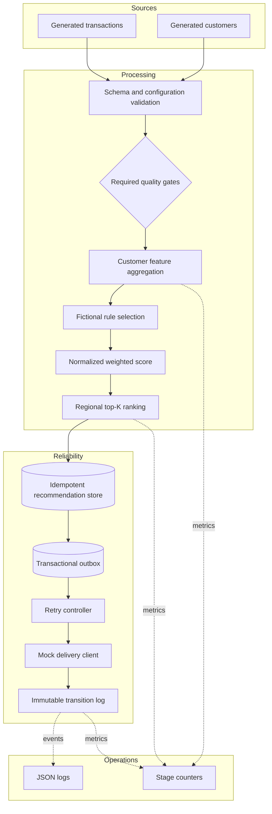

# Architecture

## Processing flow

## Design boundaries

The local pipeline uses immutable dataclasses and small functions, which keeps rule and transformation tests fast. The Spark module implements the same feature contract with DataFrame expressions. This split lets contributors examine distributed processing without making the local demo depend on a running cluster.

Recommendations receive a SHA-256 idempotency key derived from the run date, customer, and recommendation category. The in-memory store and optional Delta adapter insert a key only once. Delivery also caches a receipt per key, so replaying the same run does not issue a second simulated request.

Only a `202` response is considered accepted in this fictional protocol. Other codes and timeouts are retried, then reconciled as exhausted when the configured attempt limit is reached.

Historical rebuilding uses an explicit as-of boundary, excludes later transactions, recomputes recommendations, and writes idempotently without invoking a delivery client. This makes replay deterministic and side-effect free.

For concurrent Delta mutations, the public helper separates two concerns: bounded retry handles transient conflicts, while a literal partition predicate narrows the target read scope. One does not replace the other.

## Deployment portability

The repository includes a generic Databricks Asset Bundle example, but local execution does not require it. No cloud host, account, identity, secret scope, storage path, or private artifact registry is configured.
