# Architecture

The diagram separates the runnable local path from distributed adapters and pattern
demonstrations. The editable source is
[architecture.mmd](architecture.mmd); the presentation assets are
[SVG](assets/customer-engagement-architecture.svg) and
[PNG](assets/customer-engagement-architecture.png).

## How to read the diagram

- **Solid arrows** are executed by the default local pipeline or the dedicated rebuild
  command.
- **Dashed arrows** connect independently executable contracts, optional adapters, or
  reusable platform patterns.
- Colors identify sources, processing, lakehouse/storage, reliability/delivery, and
  operations/observability.

This distinction is deliberate. The repository demonstrates an outbox, a DAG runner, Delta
mutation retry, and partition scoping, but EngagementPipeline does not compose those modules
into one runtime.

## Runnable local path

EngagementPipeline.run performs the following sequence:

1. require all input quality checks to pass;
2. aggregate deterministic customer features in Python;
3. select fictional rules, calculate a normalized score, rank by region, and deduplicate;
4. require all output quality checks to pass;
5. insert unseen idempotency keys into an in-memory store;
6. deliver through MockDeliveryClient with bounded exponential retry and receipt caching;
7. reconcile accepted and retry-exhausted receipts;
8. emit runtime counters and a structured completion log.

Evidence: [orchestration.py](../src/engagement_platform/orchestration.py),
[pipeline integration test](../tests/integration/test_pipeline.py), and
[quality.py](../src/engagement_platform/quality.py).

## Distributed processing contract

[spark_features.py](../src/engagement_platform/spark_features.py) mirrors the local feature
fields with the PySpark DataFrame API and Spark SQL expressions: an as-of filter, grouped
maximum/count/average aggregations, a left join, null defaults, and date-difference
expressions. It is verified
under a real local Spark session in
[test_spark_features.py](../tests/integration/test_spark_features.py).

The Spark transformation is a focused distributed contract, not the implementation selected
by the local CLI. No claim is made that the entire recommendation pipeline is distributed.

## Lakehouse and Delta boundary

[storage.py](../src/engagement_platform/storage.py) provides a Delta Lake adapter that:

- resolves an existing table by name;
- merges source rows on the deterministic idempotency key;
- inserts only unmatched rows;
- creates a Delta table with change data feed enabled when the table is absent.

[retry.py](../src/engagement_platform/retry.py) classifies two explicit transient mutation
errors and applies bounded exponential backoff.
[partitioning.py](../src/engagement_platform/partitioning.py) validates identifiers, escapes
literals, and creates a static target predicate. These helpers are tested together but are
not currently wrapped around merge_recommendations_to_delta.

The SQL directory contains generic Delta table definitions and reviewable quality queries;
the local pipeline does not execute them.

## Reliability and delivery

The default pipeline sends directly through ReliableDeliveryService. Only a 202 response is
accepted; timeouts, operating-system errors, and non-202 results consume the bounded attempt
budget. Final receipts are cached by idempotency key, and reconciliation makes accepted and
retry-exhausted outcomes explicit.

[outbox.py](../src/engagement_platform/outbox.py) is an independent transactional-outbox
model. It appends events, derives the current state from an immutable transition history, and
dispatches the newest pending event per key. It is not a hidden stage in the local pipeline.

## Historical replay

The rebuild command applies an explicit as-of date, excludes later transactions, recomputes
the recommendation snapshot, and performs an idempotent local write. It never constructs a
delivery client, so external deliveries are zero by construction.

Evidence: [replay.py](../src/engagement_platform/replay.py),
[ADR 0002](decisions/0002-replay-without-side-effects.md), and
[replay integration test](../tests/integration/test_outbox_replay.py).

## Operations and platform utilities

- [monitoring.py](../src/engagement_platform/monitoring.py) emits dependency-free JSON logs
  and integer counters. It does not claim a hosted observability backend.
- [provenance.py](../src/engagement_platform/provenance.py) derives a deterministic run ID,
  stamps copied records, and fingerprints batches independently of row order.
- [dag.py](../src/engagement_platform/dag.py) validates dependencies and executes generic
  task specifications with readiness gates and explicit success, failure, or skipped states.
- [change_impact.py](../src/engagement_platform/change_impact.py) maps changed paths to
  module checks through [modules.toml](../configs/modules.toml). The current GitHub Actions
  workflow validates that resolver but does not dynamically fan out jobs from its matrix.

## Deployment portability

The [Databricks bundle](../databricks.yml) and
[job resource](../resources/demo_job.yml) are a Databricks-compatible deployment example for
the wheel and CLI. They include no workspace host, identity, secret scope, catalog binding,
cloud storage path, or proof of an executed deployment.

Local execution is the reproducible reference. The bundle demonstrates reviewable packaging
and job configuration, not a live workspace or a production workload.
