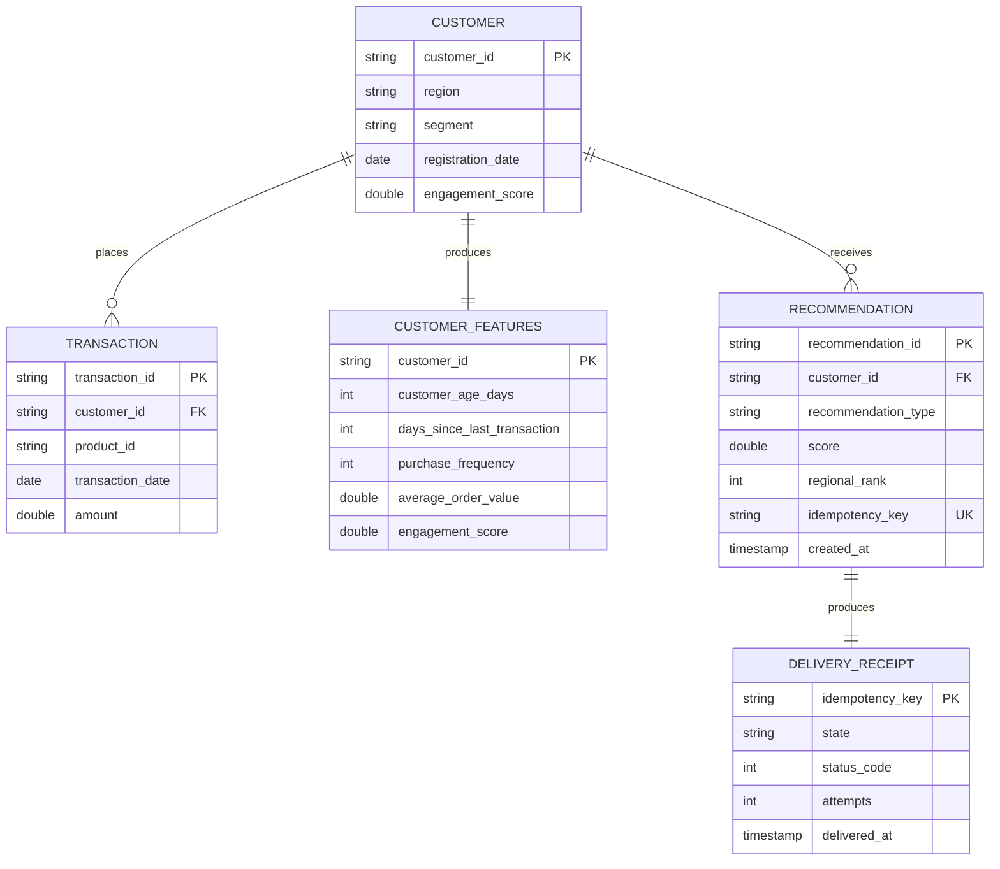

# Data model

```mermaid
erDiagram
    CUSTOMER ||--o{ TRANSACTION : places
    CUSTOMER ||--|| CUSTOMER_FEATURES : produces
    CUSTOMER ||--o{ RECOMMENDATION : receives
    RECOMMENDATION ||--|| DELIVERY_RECEIPT : produces

    CUSTOMER {
        string customer_id PK
        string region
        string segment
        date registration_date
        double engagement_score
    }
    TRANSACTION {
        string transaction_id PK
        string customer_id FK
        string product_id
        date transaction_date
        double amount
    }
    CUSTOMER_FEATURES {
        string customer_id PK
        int customer_age_days
        int days_since_last_transaction
        int purchase_frequency
        double average_order_value
        double engagement_score
    }
    RECOMMENDATION {
        string recommendation_id PK
        string customer_id FK
        string recommendation_type
        double score
        int regional_rank
        string idempotency_key UK
        timestamp created_at
    }
    DELIVERY_RECEIPT {
        string idempotency_key PK
        string state
        int status_code
        int attempts
        timestamp delivered_at
    }
```

Every sample row is hand-authored or created by `engagement_platform.synthetic`. Identifiers are sequential demonstration values; dates and amounts are artificial.
