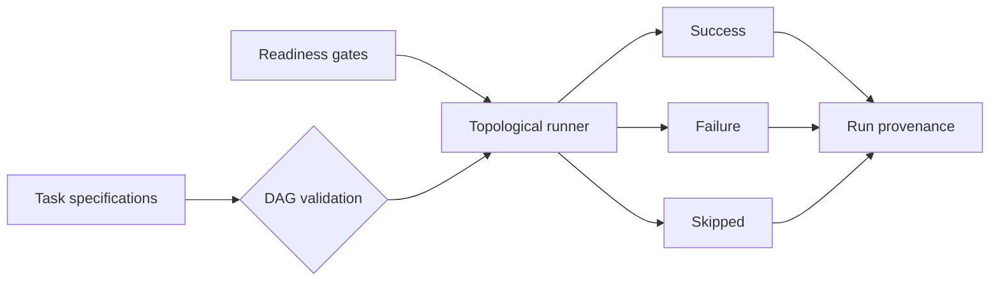
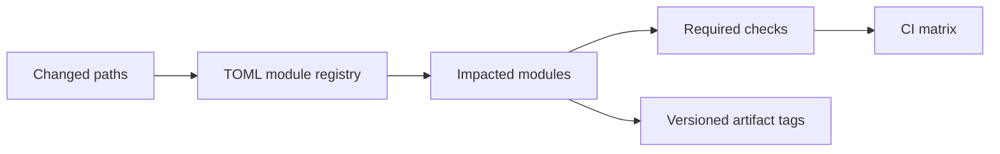

# Modular platform design

This layer demonstrates repository-scale platform concerns independently from the recommendation domain.

## Orchestration



`DagRunner` rejects duplicate names, unknown dependencies, and cycles before execution. Tasks can require all dependencies to succeed or continue when at least one alternative succeeds. Failed gates and unsatisfied dependencies create explicit skipped executions rather than ambiguous missing output.

## Provenance

`RunContext` creates a deterministic run identifier from the pipeline name, source version, as-of date, and canonical parameters. Stamping returns a new record with run metadata and never mutates the source. `batch_fingerprint` produces an order-independent SHA-256 digest for synthetic batch comparison.

## Change-impact resolution



The registry belongs to this portfolio repository and describes three generic modules. One path may affect multiple modules, so the resolver preserves overlapping ownership and deduplicates required checks. Unmatched paths remain visible instead of being silently ignored.

Example:

```bash
engagement-platform impact \
  --registry configs/modules.toml \
  --changed src/engagement_platform/spark_features.py docs/architecture.md
```

## Benchmark harness

The benchmark command uses generated data and reports measured input/output counts, elapsed time, and records per second. Results are intentionally produced at runtime rather than committed as durable performance claims.
